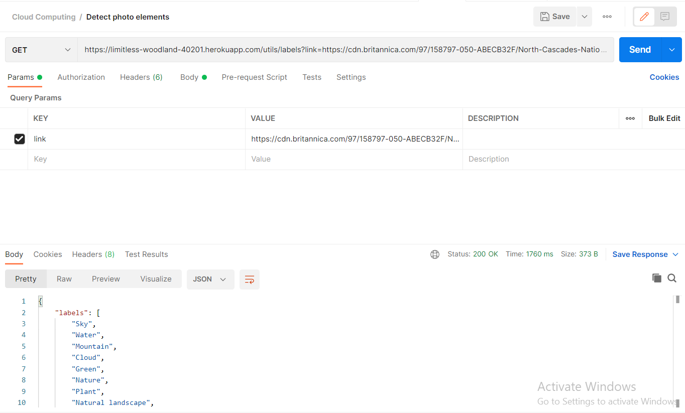
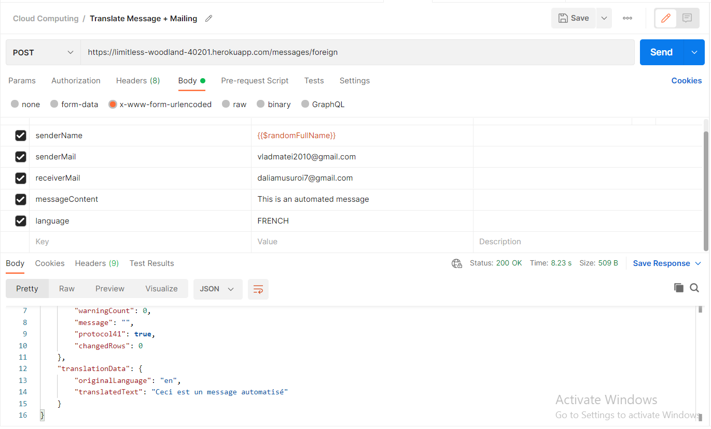
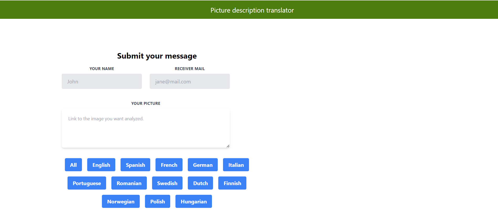

Introducere:
Aplicația prezentată a fost creată utilizând limbajul de programare Javascript, Node.js pentru back-end si React pentru front-end. Node.js este un mediu de rulare JavaScript open-source, multiplatformă, care rulează pe motorul V8 și execută cod JavaScript în afara unui browser web. React este o bibliotecă JavaScript front-end gratuită și open-source pentru construirea de interfețe cu utilizatorul bazate pe componente UI. Este întreținut de Meta și de o comunitate de dezvoltatori individuali și companii. Pe lângă toate acestea, se utilizează servicii din Google Cloud precum Translate, CloudVisio, SQL, servicii Sendgird și Heroku pentru publicare.

Descrierea problemei:
Compania X se ocupă cu traducerea documentelor oficiale în limbi străine. Managementul acestei companii a decis că ar fi benefic pentru companie să găsească o nouă sursă de profit. Astfel, s-a decis oferirea unui nou serviciu: cursuri de limbi străine pentru copii între 8 și 16 ani. Inițial, cursurile se bazau pe analiza de imagini și pe traducerea obiectelor din imagini în limba cursului respectiv, însă feedback-ul de la copii nu a fost unul pozitiv. Pentru a face materia și mai interactivă, s-a decis crearea și utilizarea unei aplicații capabile să analizeze singură imaginile și să traducă denumirile obiectelor din imagine în limba selectată. Pentru a se asigură că tinerii se focusează pe acumularea de cunoștințe și nu pe notarea cuvintelor în caiet, cuvintele din pozele analizate sunt transmise pe mail. Acest lucru îi ajută la recapitulare. După ce cuvintele traduse sunt trimise pe mail, copiii se uită la imagine și încearcă să ghicească ce înseamnă cuvântul respectiv, făcând asocierea cu imaginea. Copiii au fost entuziasmați iar implementarea aplicației a adus un mare profit companiei X (și Daliei un 10 la Cloud Computing).

Descriere API:
Api-urile folosite pentru aplicație sunt:
CloudVisio: este un serviciu Google Cloud care se ocupă cu analiza de poze. A fost folosit pentru identificarea elementelor dintr-o fotografie. Api-ul primește drept parametru un link către o poză, o analizează cu ajutorul CloudVisio și returnează etichetele (labels) acelei poze.

Request către API CloudVisio
Cloud Translation: este un serviciu care se ocupă cu traducerea textului într-una sau mai multe limbi selectate. Este foarte similar cu bine-cunoscutul Google Translate și a fost folosit în aplicație cu acest scop. După ce sunt identificate etichetele, acestea sunt traduse din limba engleză într-una dintre limbile selectate.
SendGrid: este un serviciu ce oferă API-uri pentru trimiterea automată de emailuri și a fost folosit întocmai în cadrul aplicației. După ce au fost traduse, etichetele traduse sunt trimise pe mail către destinatarul specificat.

Request către API Cloud Translate și Sendgrid

Flux de date

Interfață aplicație
În momentul în care utilizatorul intră în aplicație, este întâmpinat de interfața prietenoasă. Acesta introduce numele său, mail-ul către care vrea să trimită informația și link-ul pozei pe care vrea să o analizeze. Mai apoi, selectează limba în care vrea să fie tradus textul (limba străină a cursului la care se află elevul). Link-ul pozei este trimis ca parametru către API-ul creat care utilizează serviciul CloudVisio și acesta returnează etichetele pozei. Etichetele împreună cu numele și mail-ul introduse sunt stocate în tabela din baza de date și trimise împreună cu limba selectată către API-ul responsabil de traducere. Traducerea este trimisă către API-ul SendGrid de trimitere a mail-urilor și acestea sunt trimise către destinatarul precizat.

Referințe:
Github Back-End: https://github.com/daliamsr/CloudComputing-Back/tree/02_Final_Project
Github Front-End: https://github.com/daliamsr/cloudcomputing-front/tree/02_Final_Project
Youtube Prezentare: https://youtu.be/wo0IncxaHO0
